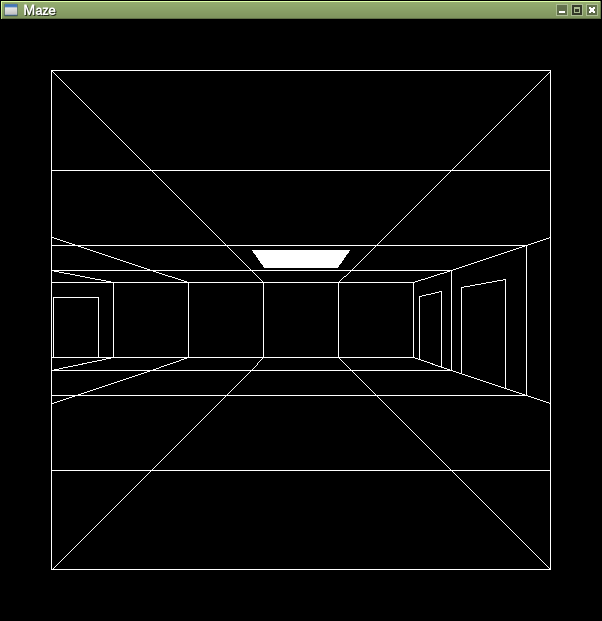
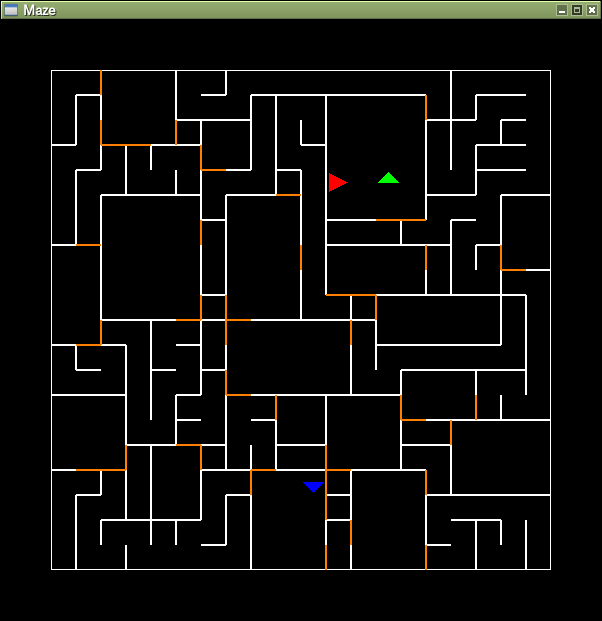
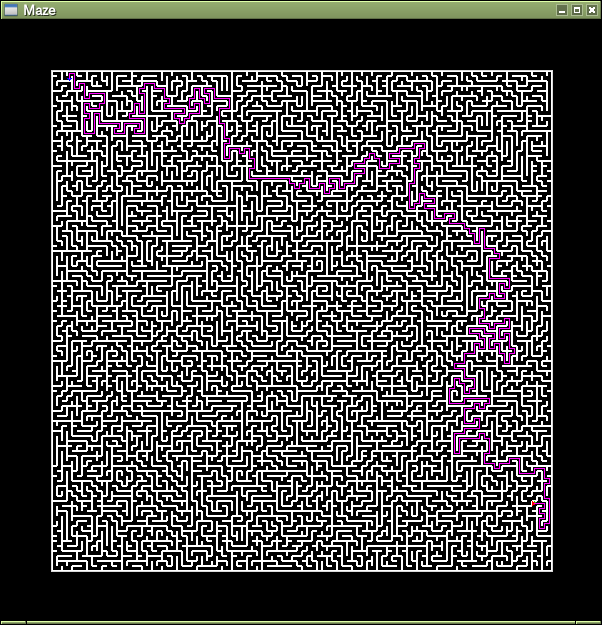
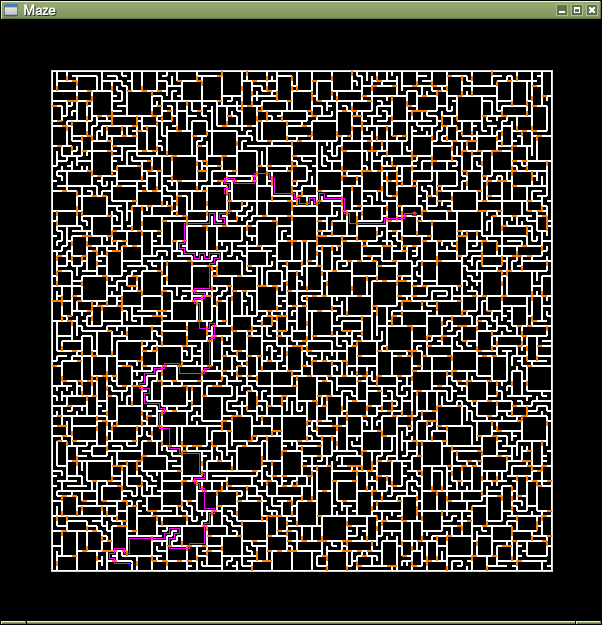

# MazeGame
ウィザードリィ風のワイヤーフレーム表示の迷路探索ゲーム  


## 機能
穴掘り法＋部屋作成で迷路作成しています。  
イベントを何も実装していないので、ゴールなどありません。

## 必要要件
下記の環境で動かしました。  
- Debian 11 stable
- Python 3.9
- Tkinter 3.9
- Pillow 8.1

## 起動方法
```
python3 game.py
```

## 操作方法
- ESCキー：終了
- 上キー：前へ進む
- 左キー：左に向く
- 右キー：右に向く
- 下キー：振り向く
- PageUpキー：階段を上る
- PageDownキー：階段を下る
- Shift + Hキー：地図表示（上階段までの経路付き）
- Shift + Lキー：地図表示（下階段までの経路付き）
- Shift + Mキー：地図表示（全体）
- Mキー：地図表示（通った道のみ）
  - 白の線：壁
  - オレンジの線：扉
  - 赤紫色の線：経路
  - 赤の三角：プレイヤーの現在地
  - 緑マーク：上の階段
  - 青マーク：下の階段



## 改造
game.pyの迷路オブジェクトのパラメータを変えると色々な迷路が作成できます。  
迷路を大きくすると地図表示しながらでも探索が大変になると思います。  
```
self.mz = maze.Maze(20, 20, seed=self.seed)  
```
- 第1引数：迷路の横幅
- 第2引数：迷路の縦幅
- seed引数：乱数のシード値
- room引数：部屋の発生確率（0-100）  
  0だと部屋なしの迷路、100だと部屋だらけの迷路になります。  
  ただし100だからといって迷路全てが部屋になるわけではありません。  

### 部屋なし
```
self.mz = maze.Maze(100, 100, seed=self.seed, room=0)  
```


### 部屋たくさん
```
self.mz = maze.Maze(100, 100, seed=self.seed, room=100)  
```


## その他
Pythonの勉強のために作ったプログラムなので、ツッコミどころ満載だと思いますがご容赦願います。  
RPG部分がないので実装すれば、立派なウィズ風＋ローグ風になるかも。（他力本願）  
