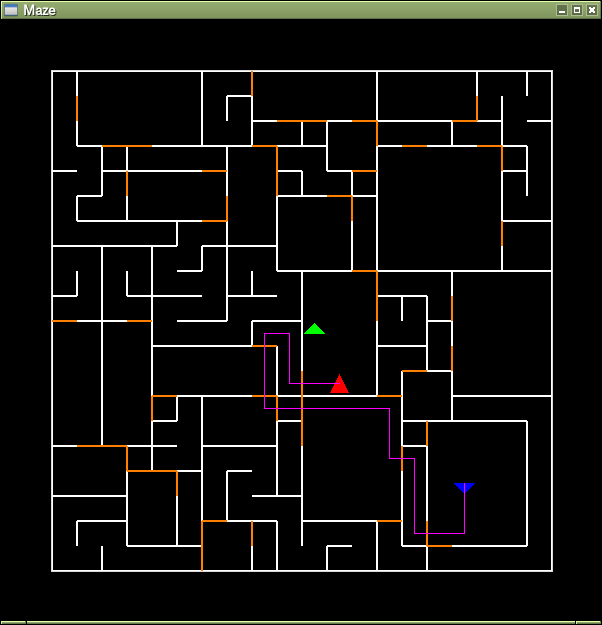

# MazeGame
ウィザードリィ風のワイヤーフレーム表示の迷路探索ゲーム  


## 機能
穴掘り法＋部屋作成で迷路作成しています。（ローグ方式の作成とは異なる）  
ワイヤーフレーム表示だけで下り階段を探すと高難易度（乱数によるけど）なので地図＆経路付きです。  
経路は幅優先探索を行った後、目的地から現在地までを求めてます。  
イベントを何も実装していないので、ゴールなどありません。（メモリが許す限り無限）

## 必要要件
下記の環境で動かしました。  
- Debian 11 stable
- Python 3.9
- Tkinter
- Pillow
- SQLite3（セーブ＆ロード機能で使用。新たにインストール不要、Python標準機能のみでOKと思われる。）

## 起動方法
```
python3 game.py
```

## 操作方法
- ESCキー：終了
- 上キー：前へ進む
- 左キー：左に向く
- 右キー：右に向く
- 下キー：振り向く
- Sキー：セーブ
- Lキー：ロード
- PageUpキー：階段を上る
- PageDownキー：階段を下る
- Shift + PageUpキー：地図表示（上り階段までの経路付き）
- Shift + PageDownキー：地図表示（下り階段までの経路付き）
- Shift + Mキー：地図表示（全体）
- Mキー：地図表示（通った道のみ）
  - 白の線：壁
  - オレンジの線：扉
  - 赤紫色の線：経路
  - 赤の三角：プレイヤーの現在地
  - 緑マーク：上の階段
  - 青マーク：下の階段



## 改造
game.pyの迷路オブジェクトのパラメータを変えると色々な迷路が作成できます。  
迷路を大きくすると地図表示しながらでも探索が大変になると思います。  
```
self.mz = maze.Maze(20, 20, seed=self.seed)  
```
- 第1引数：迷路の横幅
- 第2引数：迷路の縦幅
- seed引数：乱数のシード値
- room引数：部屋の発生確率（0-100）  
  0だと部屋なしの迷路、100だと部屋だらけの迷路になります。  
  ただし100だからといって迷路全てが部屋になるわけではありません。  

### 部屋なし
```
self.mz = maze.Maze(100, 100, seed=self.seed, room=0)  
```


### 部屋たくさん
```
self.mz = maze.Maze(100, 100, seed=self.seed, room=100)  
```


## その他
RPG部分がないので実装すれば、立派なウィズ風＋ローグ風になるかも。（他力本願）  
